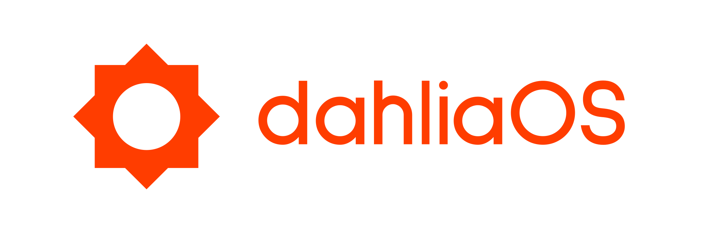

  
  

# Official dahliaOS brand resources

The dahliaOS brand is unique and it belongs to the dahliaOS organization and project.
#

## General information
Brand resources can be used in compliance of our Apache License 2.0

Monochrome resources or resources with black or white text are named accordingly.
  - "_dark" white text for dark mode
  - "_light" black text for light mode

#

## Logo and banner

dahliaOS uses a logo or a banner for any kind of visual branding.

We provide a colored as well as a monochrome version of either. 

## Logo

  
  
  

## Banner

  
  
  

### Sources
Assets with transparent background: ``assets/dahliaos/{logo/banner}`` [PNG and SVG]

Static images with solid background: ``static/dahliaos/{logo/banner}`` [PNG only]

#

## Project and product names

dahliaOS is a project name - written in camelCase capitalization

It can also be used along with product names (for example, “dahliaOS App Store”) to refer to a specific application/service.

#

## Application branding

Brand resources for our apps (if existent) can be found under ``assets/applications/{application name}``

For example: ``assets/applications/graft``

#

## Fonts

Brand: Sulphur Point

Interface: Inter

Website: Roboto

#

## Colors

Primary color: #FF3D00

 

Dark background color: #212121

 

Light background color: #FFFFFF

 

#

## 3rd parties and community

We kindly ask third-party developers creating apps/designs for dahliaOS to adopt certain elements of the dahliaOS brand for consistency:

* Fonts.

However, we restrict the usage of the dahliaOS name and marks:

* You are encouraged to say that your app or service is “designed for dahliaOS,” but do not use the dahliaOS name or marks as part of the name of your company, application, product, or service—or in any logo you create.

* Only use the dahliaOS name or marks to refer to dahliaOS or its products.

#

## License

  
  

Copyright @ 2019-2022 - The dahliaOS Authors - contact@dahliaos.io

This project is licensed under the [Apache 2.0 license](/LICENSE)
